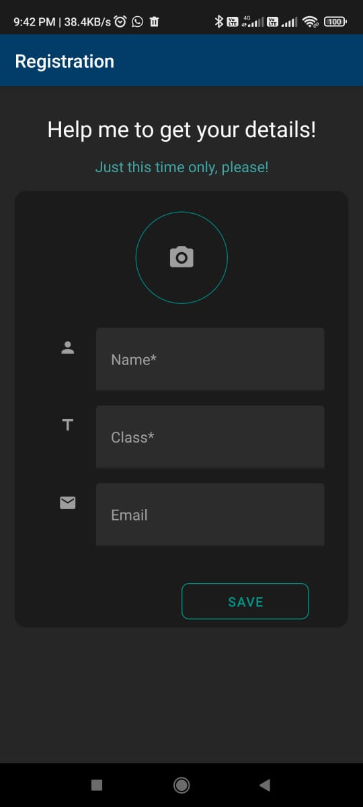
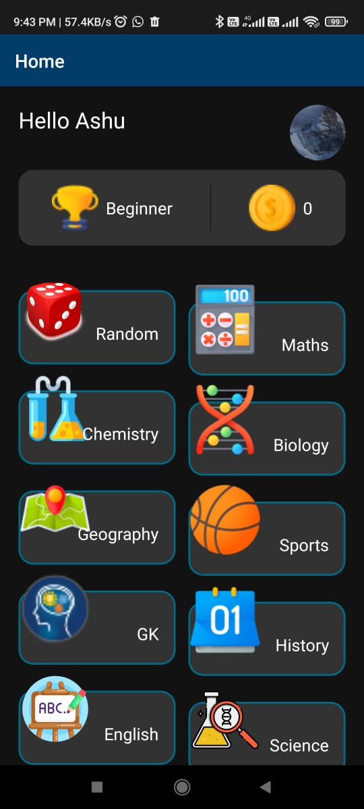
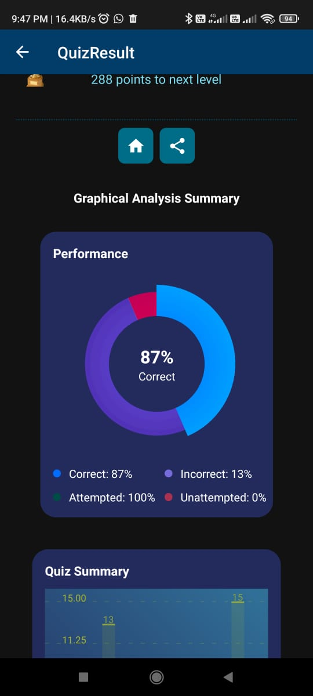

# QuizPlay: Fun Learning for Kids

Welcome to QuizPlay, the ultimate learning companion for primary kids! Our app is designed to make learning engaging and enjoyable through interactive quizzes. With a vast collection of over 1000 questions, kids can explore various categories and boost their knowledge while having fun.

## Key Features

- **Educational Quizzes:** Covering a range of subjects from General Knowledge to Science, our quizzes are crafted for primary school kids.
- **Kid-Friendly Interface:** Simple and intuitive UI to ensure a seamless learning experience for young minds.
- **Visual Learning:** Engaging visuals and easy-to-understand questions make learning a delightful experience.
- **Continuous Updates:** We are constantly working on improvements, including adding new categories and fetching questions from reliable sources to keep the content fresh.

## Technologies Used
- React native with ExpoGO

## Getting Started

To get started with QuizPlay, follow these steps:

0. Download the APK and start interacting, alternative you can pull the repo and start playing. Built on Expo go
1. Clone the repository: `git clone https://github.com/your-username/your-repo.git`
2. Install dependencies: `npm install`
3. Run the app: `npm start`

## Screenshots

*Registration Page*

*Home Page*

*Quiz Play Ground*

*Performance Analysis*

## Contributing

We welcome contributions! If you'd like to contribute to QuizPlay, please follow our [contribution guidelines](CONTRIBUTING.md).

Download QuizPlay now and let the learning adventure begin!

*Stay tuned for exciting updates as we enhance the app to provide an even better learning experience for your little ones.*
